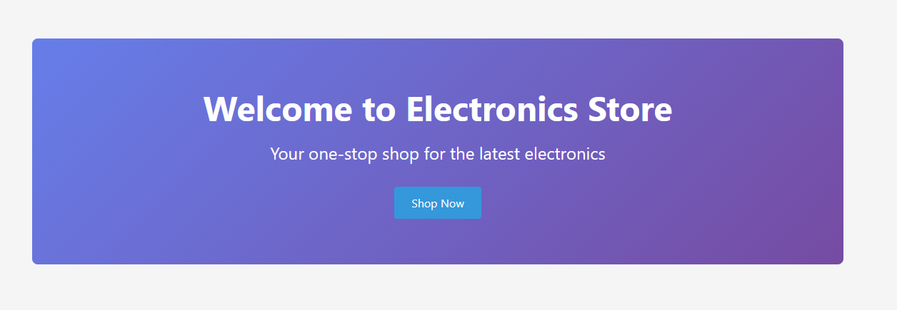
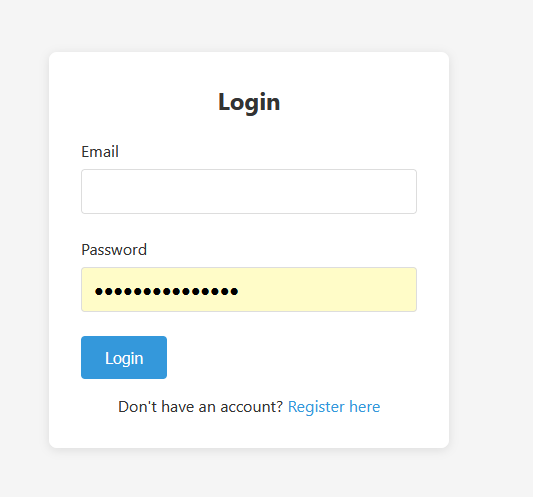
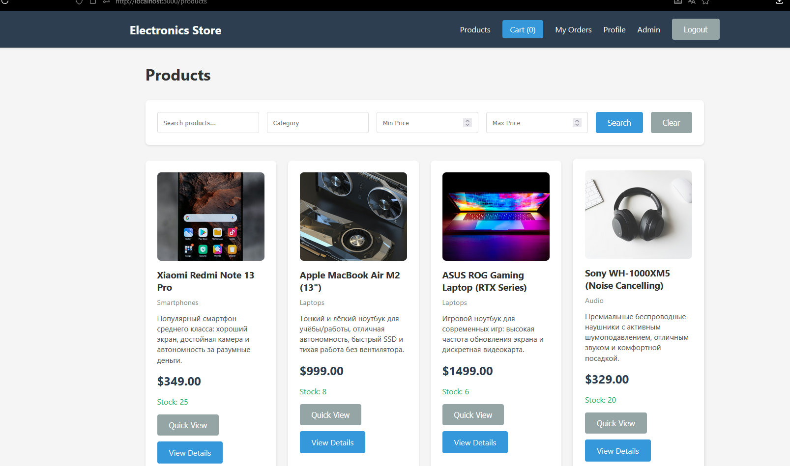
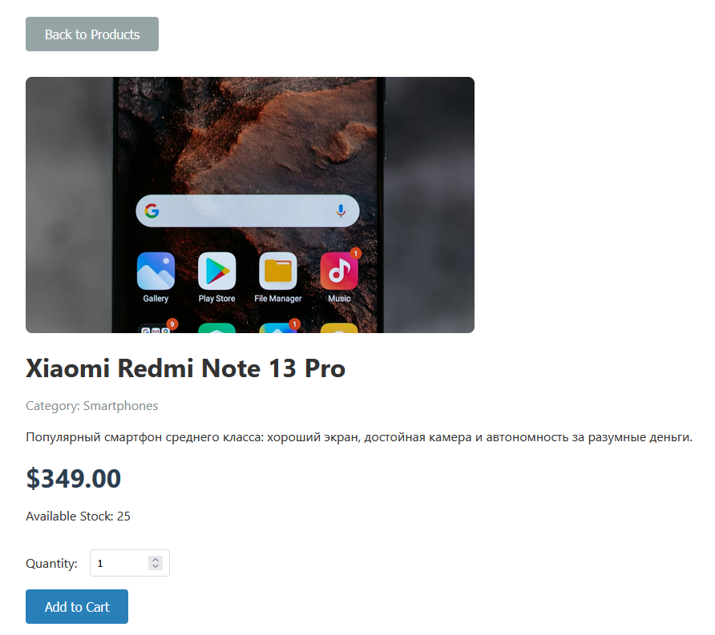
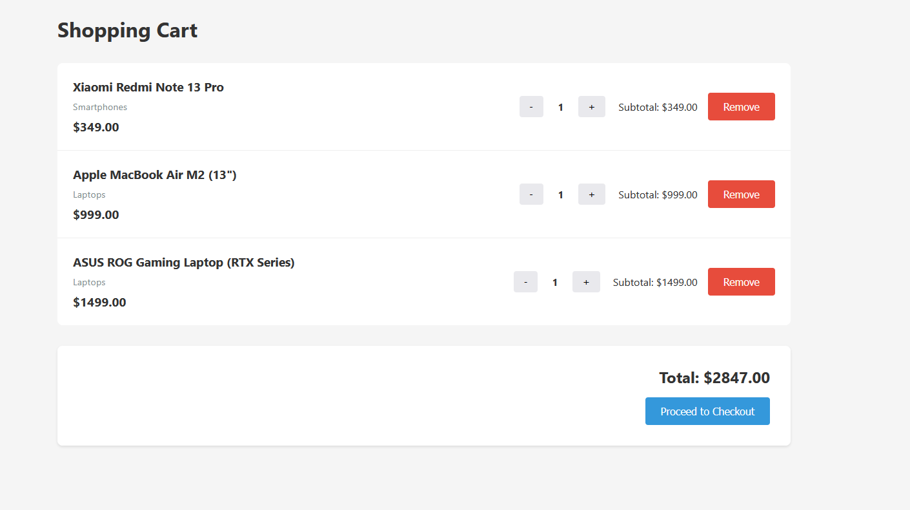

# Electronics Store Website

A full-stack e-commerce application for electronics built with React, Node.js, Express, and MongoDB.


## Features

### User Features
- User registration and authentication with JWT
- Browse products with search and filter options
- View product details
- Shopping cart functionality
- Place orders and view order history
- Update user profile

### Admin Features
- Product management (Create, Read, Update, Delete)
- Order status management
- Admin-only routes and features

## Tech Stack

### Backend
- **Node.js** - Runtime environment
- **Express** - Web framework
- **MongoDB** - Database
- **Mongoose** - ODM for MongoDB
- **JWT** - Authentication
- **bcrypt** - Password hashing

### Frontend
- **React** - UI library
- **React Router** - Routing
- **Axios** - HTTP client
- **Vite** - Build tool

## Project Structure

```
FinalWeb/
├── backend/
│   ├── src/
│   │   ├── config/
│   │   │   └── db.js
│   │   ├── models/
│   │   │   ├── User.js
│   │   │   ├── Product.js
│   │   │   └── Order.js
│   │   ├── controllers/
│   │   │   ├── authController.js
│   │   │   ├── userController.js
│   │   │   ├── productController.js
│   │   │   └── orderController.js
│   │   ├── routes/
│   │   │   ├── authRoutes.js
│   │   │   ├── userRoutes.js
│   │   │   ├── productRoutes.js
│   │   │   └── orderRoutes.js
│   │   ├── middleware/
│   │   │   ├── auth.js
│   │   │   └── errorHandler.js
│   │   └── app.js
│   ├── server.js
│   ├── package.json
│   └── .env.example
│
└── frontend/
    ├── src/
    │   ├── api/
    │   │   └── axios.js
    │   ├── components/
    │   │   ├── Navbar.jsx
    │   │   └── ProtectedRoute.jsx
    │   ├── context/
    │   │   ├── AuthContext.jsx
    │   │   └── CartContext.jsx
    │   ├── pages/
    │   │   ├── Home.jsx
    │   │   ├── Register.jsx
    │   │   ├── Login.jsx
    │   │   ├── Products.jsx
    │   │   ├── ProductDetail.jsx
    │   │   ├── Cart.jsx
    │   │   ├── Checkout.jsx
    │   │   ├── Profile.jsx
    │   │   ├── Orders.jsx
    │   │   ├── OrderDetail.jsx
    │   │   └── AdminProducts.jsx
    │   ├── App.jsx
    │   ├── main.jsx
    │   └── index.css
    ├── index.html
    ├── vite.config.js
    └── package.json
```

## Installation & Setup

### Prerequisites
- Node.js (v14 or higher)
- MongoDB (running locally or MongoDB Atlas account)
- npm or yarn

### Backend Setup

1. Navigate to the backend directory:
```bash
cd backend
```

2. Install dependencies:
```bash
npm install
```

3. Create a `.env` file by copying `.env.example`:
```bash
copy .env.example .env
```

4. Update the `.env` file with your configuration:
```env
PORT=5000
MONGO_URI=mongodb://localhost:27017/electronics-store
JWT_SECRET=your_super_secret_jwt_key_change_this_in_production
```

5. Start the backend server:
```bash
npm run dev
```

The backend server will run on `http://localhost:5000`

### Frontend Setup

1. Open a new terminal and navigate to the frontend directory:
```bash
cd frontend
```

2. Install dependencies:
```bash
npm install
```

3. Start the frontend development server:
```bash
npm run dev
```

The frontend will run on `http://localhost:5173`

## API Endpoints

### Authentication
- `POST /api/auth/register` - Register new user
- `POST /api/auth/login` - Login user

### Users
- `GET /api/users/profile` - Get user profile (authenticated)
- `PUT /api/users/profile` - Update user profile (authenticated)

### Products
- `GET /api/products` - Get all products (supports query params: search, category, minPrice, maxPrice)
- `GET /api/products/:id` - Get single product
- `POST /api/products` - Create product (admin only)
- `PUT /api/products/:id` - Update product (admin only)
- `DELETE /api/products/:id` - Delete product (admin only)

### Orders
- `POST /api/orders` - Create order (authenticated)
- `GET /api/orders/my` - Get current user's orders (authenticated)
- `GET /api/orders/:id` - Get order by ID (authenticated)
- `PUT /api/orders/:id/status` - Update order status (admin only)

## Default Admin Account

To create an admin account, you can either:

1. Register a normal user and manually update the role in MongoDB:
```javascript
db.users.updateOne(
  { email: "admin@example.com" },
  { $set: { role: "admin" } }
)
```

2. Or modify the User model temporarily to allow role selection during registration.

## Usage

1. **Register/Login**: Create an account or login with existing credentials
2. **Browse Products**: View all products, search by name/description, filter by category or price
3. **Add to Cart**: Click on a product to view details and add to cart
4. **Checkout**: Review your cart and place an order
5. **View Orders**: Check your order history and details
6. **Admin Panel**: If logged in as admin, access product management features

## Security Features

- Passwords are hashed using bcrypt
- JWT tokens for authentication
- Protected routes for authenticated users
- Admin-only routes for privileged operations
- Input validation on all endpoints
- Error handling middleware

## Development Notes

- The application uses async/await for all asynchronous operations
- MongoDB timestamps are automatically added to all models
- JWT tokens expire after 7 days
- Cart data is stored in localStorage
- All API responses follow a consistent JSON format

## Troubleshooting

### MongoDB Connection Issues
- Ensure MongoDB is running locally or check your MongoDB Atlas connection string
- Verify the `MONGO_URI` in your `.env` file is correct

### CORS Issues
- The backend is configured to accept requests from all origins in development
- For production, update the CORS configuration in `app.js`

### Port Conflicts
- If port 5000 or 3000 is already in use, update the port in `.env` (backend) or `vite.config.js` (frontend)

## Deployment (Vercel + Atlas)

### 1. Prepare MongoDB Atlas
1. Create a cluster in MongoDB Atlas.
2. Create a database user.
3. In `Network Access`, allow your deploy environment IP (for quick setup you can use `0.0.0.0/0`).
4. Copy your Atlas connection string to `MONGO_URI`.

### 2. Deploy Backend to Vercel
1. Create a new Vercel project with root directory `backend`.
2. Add environment variables:
   - `MONGO_URI=<your-atlas-uri>`
   - `JWT_SECRET=<your-secret>`
   - `CLIENT_URL=https://<your-frontend>.vercel.app`
3. Deploy and copy backend URL:
   - `https://<your-backend>.vercel.app`

### 3. Deploy Frontend to Vercel
1. Create another Vercel project with root directory `frontend`.
2. Add environment variable:
   - `VITE_API_URL=https://<your-backend>.vercel.app/api`
3. Deploy frontend.

### 4. Verify
1. Open frontend URL.
2. Register/login.
3. Open products, cart, checkout.
4. Verify admin page with admin account.

## Screenshots in README

Put your screenshot files into `docs/screenshots/` with these names:
- `docs/screenshots/home.png`
- `docs/screenshots/login.png`
- `docs/screenshots/products.png`
- `docs/screenshots/product-detail.png`
- `docs/screenshots/cart.png`
- `docs/screenshots/checkout.png`
- `docs/screenshots/orders.png`
- `docs/screenshots/admin-products.png`

Then add this section (or keep this one as-is):

## Screenshots

### Home Page


### Login Page


### Products Page


### Product Detail


### Cart Page



## License

This project is created for educational purposes as a university final project.
